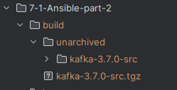
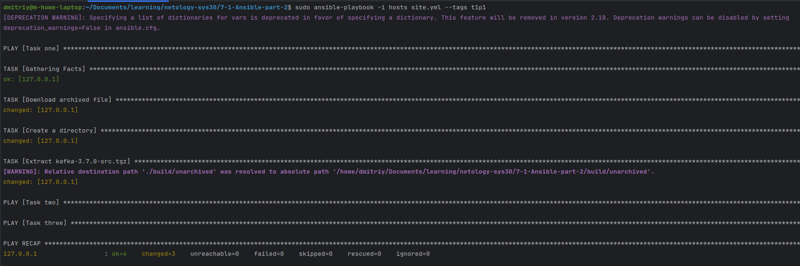
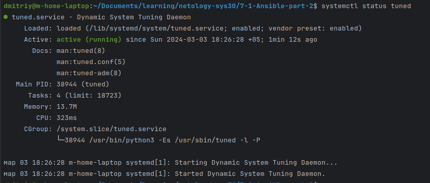
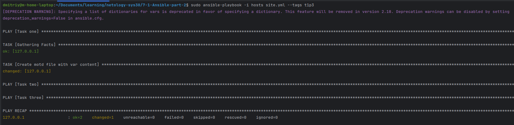
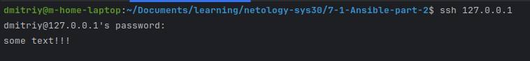
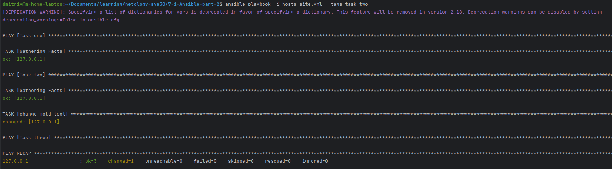
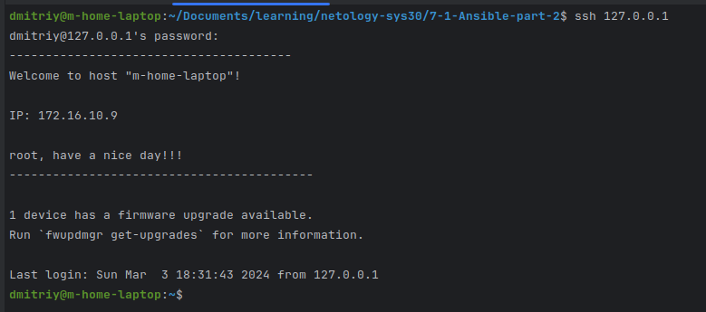
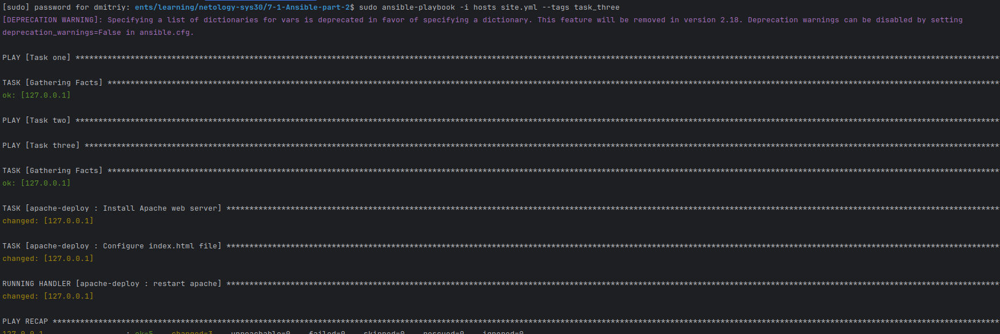
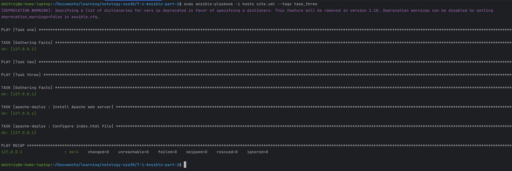
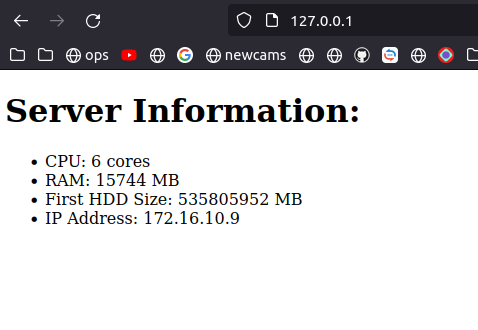

# Домашнее задание к занятию "`Ansible. Часть 2`" - `Дубровин Дмитрий`


### Инструкция по выполнению домашнего задания

   1. Сделайте `fork` данного репозитория к себе в Github и переименуйте его по названию или номеру занятия, например, https://github.com/имя-вашего-репозитория/git-hw или  https://github.com/имя-вашего-репозитория/7-1-ansible-hw).
   2. Выполните клонирование данного репозитория к себе на ПК с помощью команды `git clone`.
   3. Выполните домашнее задание и заполните у себя локально этот файл README.md:
      - впишите вверху название занятия и вашу фамилию и имя
      - в каждом задании добавьте решение в требуемом виде (текст/код/скриншоты/ссылка)
      - для корректного добавления скриншотов воспользуйтесь [инструкцией "Как вставить скриншот в шаблон с решением](https://github.com/netology-code/sys-pattern-homework/blob/main/screen-instruction.md)
      - при оформлении используйте возможности языка разметки md (коротко об этом можно посмотреть в [инструкции  по MarkDown](https://github.com/netology-code/sys-pattern-homework/blob/main/md-instruction.md))
   4. После завершения работы над домашним заданием сделайте коммит (`git commit -m "comment"`) и отправьте его на Github (`git push origin`);
   5. Для проверки домашнего задания преподавателем в личном кабинете прикрепите и отправьте ссылку на решение в виде md-файла в вашем Github.
   6. Любые вопросы по выполнению заданий спрашивайте в чате учебной группы и/или в разделе “Вопросы по заданию” в личном кабинете.
   
Желаем успехов в выполнении домашнего задания!
   
### Дополнительные материалы, которые могут быть полезны для выполнения задания

1. [Руководство по оформлению Markdown файлов](https://gist.github.com/Jekins/2bf2d0638163f1294637#Code)

---
Итоговое домашнее задание собрано в один [плейбук](site.yml) и разбито на разные плеи,
а так же тегировано по пунктам для простоты запуска отдельных этапов.

### Задание 1
#### Пункт 1



```
    - name: Download archived file
      ansible.builtin.get_url:
        url: https://downloads.apache.org/kafka/3.7.0/kafka-3.7.0-src.tgz
        dest: ./build/
      tags: t1p1

    - name: Create a directory
      ansible.builtin.file:
        path: ./build/unarchived
        state: directory
      tags: t1p1

    - name: Extract kafka-3.7.0-src.tgz
      ansible.builtin.unarchive:
        src: ./build/kafka-3.7.0-src.tgz
        dest: ./build/unarchived
      tags: t1p1
```
#### Пункт 2





```
    - name: Install tuned
      apt:
        name: tuned
        state: present
        update_cache: yes
      tags: t1p2

    - name: Start and enable tuned
      ansible.builtin.service:
        name: tuned
        state: started
        enabled: yes
      tags: t1p2

```
#### Пункт 3



```
- name: Task one
  hosts: all
  become: yes
  vars:
    - motd_text: "some text!!!"
  tasks:
  
    - name: Create motd file with var content
      ansible.builtin.copy:
        content: '{{ motd_text }}'
        dest: /etc/motd
      tags: t1p3
```
---

### Задание 2





```
#site.yml
- name: Task two
  hosts: all
  become: yes
  tags: task_two
  tasks:

    - name: change motd text
      template:
        src: motd.j2
        dest: /etc/motd
   
#motd.j2
---------------------------------------
Welcome to host "{{ansible_hostname}}"!

IP: {{ansible_default_ipv4.address}}

{{ansible_env.USER}}, have a nice day!!!
------------------------------------------
```

---

### Задание 3
Первый запуск:


Второй запуск(без изменения шаблона - апатч не перезапускается):

Результат:



```
#site.yml
- name: Task three
  hosts: all
  become: yes
  tags: task_three
  roles:
    - apache-deploy
    
#handlers/main.yml
---
- name: restart apache
  service:
    name: apache2
    state: restarted

#tasks/main.yml
---
- name: Install Apache web server
  package:
    name: apache2
    state: present

- name: Configure index.html file
  template:
    src: index.html.j2
    dest: /var/www/html/index.html
    mode: '0644'
  notify: restart apache

#templates/index.html.j2
<!DOCTYPE html>
<html>
<body>
  <h1>Server Information:  </h1>
  <ul>
    <li>CPU: {{ ansible_processor_cores }} cores</li>
    <li>RAM: {{ ansible_memtotal_mb }} MB</li>
    <li>First HDD Size: {{ ansible_mounts[1].size_total }} MB</li>
    <li>IP Address: {{ ansible_default_ipv4.address }}</li>
  </ul>
</body>
</html>

```
