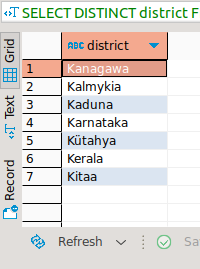

# Домашнее задание к занятию «SQL. Часть 1» - Дмитрий Дубровин

---

Задание можно выполнить как в любом IDE, так и в командной строке.

### Задание 1

Получите уникальные названия районов из таблицы с адресами, которые начинаются на “K” и заканчиваются на “a” и не содержат пробелов.

```sql 
SELECT DISTINCT district
FROM sakila.address
WHERE district LIKE 'K%a' AND
district NOT LIKE '% %';
```

---
### Задание 2

Получите из таблицы платежей за прокат фильмов информацию по платежам, которые выполнялись в промежуток с 15 июня 2005 года по 18 июня 2005 года **включительно** и стоимость которых превышает 10.00.

```sql
SELECT * 
FROM sakila.payment
WHERE payment_date BETWEEN '2005-06-15' AND '2005-06-18 23:59:59'
AND amount > 10.00; 
```

---

### Задание 3

Получите последние пять аренд фильмов.

```sql
SELECT *
FROM sakila.rental
ORDER BY rental_date DESC 
LIMIT 5;
```


---
### Задание 4

Одним запросом получите активных покупателей, имена которых Kelly или Willie.

Сформируйте вывод в результат таким образом:
- все буквы в фамилии и имени из верхнего регистра переведите в нижний регистр,
- замените буквы 'll' в именах на 'pp'.

```sql
SELECT REPLACE(LOWER(first_name), 'll', 'pp'), LOWER(last_name), active 
FROM sakila.customer 
WHERE (first_name = 'Kelly' OR first_name = 'Willie')
AND  active = 1;
```


## Дополнительные задания (со звёздочкой*)
Эти задания дополнительные, то есть не обязательные к выполнению, и никак не повлияют на получение вами зачёта по этому домашнему заданию. Вы можете их выполнить, если хотите глубже шире разобраться в материале.

### Задание 5*

Выведите Email каждого покупателя, разделив значение Email на две отдельных колонки: в первой колонке должно быть значение, указанное до @, во второй — значение, указанное после @.

### Задание 6*

Доработайте запрос из предыдущего задания, скорректируйте значения в новых колонках: первая буква должна быть заглавной, остальные — строчными.
