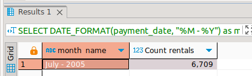

# Домашнее задание к занятию «SQL. Часть 2» - Дмитрий Дубровин

### Задание 1

Одним запросом получите информацию о магазине, в котором обслуживается более 300 покупателей, и выведите в результат следующую информацию: 
- фамилия и имя сотрудника из этого магазина;
- город нахождения магазина;
- количество пользователей, закреплённых в этом магазине.
```sql
-- Алиасы короче, но, в данном случае, как-то неинформативно 's','s2', итд. 
SELECT CONCAT( staff.first_name, ' ', staff.last_name) as 'Staff name',   city.city, count(customer.customer_id) as 'Customer count'  
FROM staff
JOIN store on store.manager_staff_id = staff.staff_id 
JOIN address on address.address_id = store.address_id
JOIN city on city.city_id = address.city_id 
JOIN customer on customer.store_id  = store.store_id 
group by store.store_id
HAVING COUNT(customer.customer_id) > 300
```


---

### Задание 2

Получите количество фильмов, продолжительность которых больше средней продолжительности всех фильмов.

```sql
SELECT COUNT(*)
FROM film
WHERE `length` > (SELECT AVG(`length`) FROM film) 
```


---

### Задание 3

Получите информацию, за какой месяц была получена наибольшая сумма платежей, и добавьте информацию по количеству аренд за этот месяц.

```sql
SELECT DATE_FORMAT(payment_date, "%M - %Y") as month_name, COUNT(rental_id) as 'Count rentals' 
FROM payment
GROUP BY month_name 
ORDER BY SUM(amount) DESC 
LIMIT 1;
```


## Дополнительные задания (со звёздочкой*)
Эти задания дополнительные, то есть не обязательные к выполнению, и никак не повлияют на получение вами зачёта по этому домашнему заданию. Вы можете их выполнить, если хотите глубже шире разобраться в материале.

### Задание 4*

Посчитайте количество продаж, выполненных каждым продавцом. Добавьте вычисляемую колонку «Премия». Если количество продаж превышает 8000, то значение в колонке будет «Да», иначе должно быть значение «Нет».

### Задание 5*

Найдите фильмы, которые ни разу не брали в аренду.
