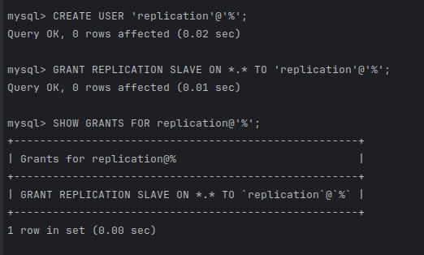
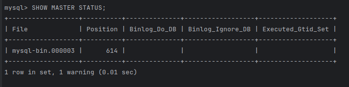
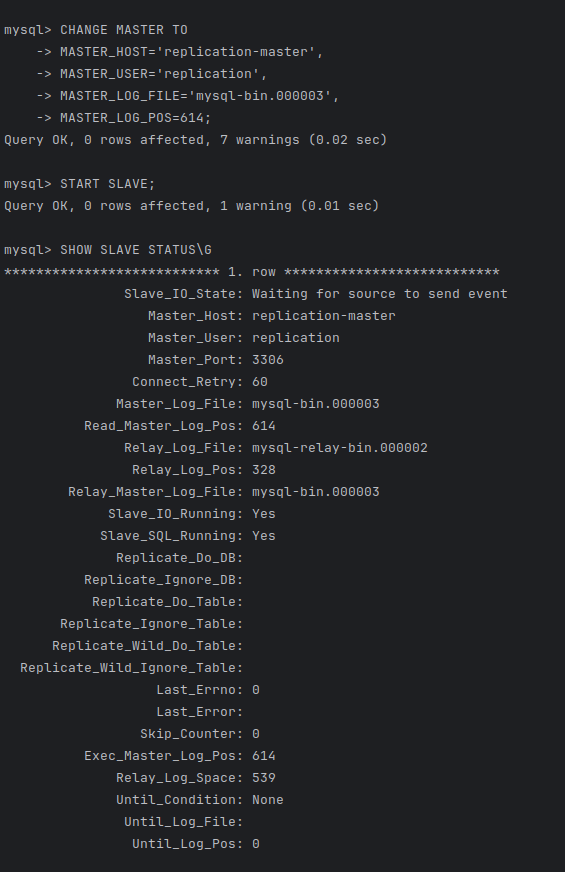

# Домашнее задание к занятию «Репликация и масштабирование. Часть 1» - Дмитрий Дубровин

---

### Задание 1

На лекции рассматривались режимы репликации master-slave, master-master, опишите их различия.

*Ответить в свободной форме.*
> * В режиме Master-Slave запись происходит только на мастере, на слейве же может происходить только чтение данных
> в то время как при схеме Master-Master можно писать данные на оба инстанса бд, что положительно влияет на
> балансировку нагрузки как при чтении, так и при записи.
> * При отказе мастера, слейв может получить его роль, но на это требуется некоторое время,
> в схеме master-master это не требуется - соответственно нарушения работы не будет. 
---

### Задание 2

Выполните конфигурацию master-slave репликации, примером можно пользоваться из лекции.

*Приложите скриншоты конфигурации, выполнения работы: состояния и режимы работы серверов.*

> * Проект разворачивал при помощи [compose-файла](compose%2Fdocker-compose.yml)
> * Файлы конфигурации my.cnf с [мастера](compose%2Fmaster_my.cnf) и [слейва](compose%2Fslave_my.cnf)
> * Создание пользователя на мастере:\
>
> * Статус мастера:\
> 
> * Настройка и статус слейва:\
>

---

### Задание 3* 

Выполните конфигурацию master-master репликации. Произведите проверку.

*Приложите скриншоты конфигурации, выполнения работы: состояния и режимы работы серверов.*
