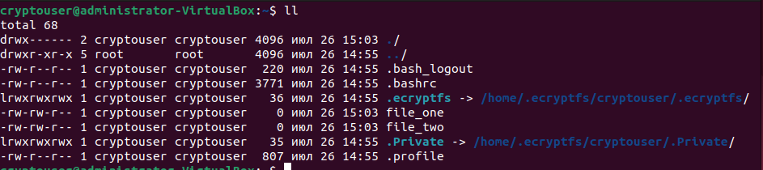
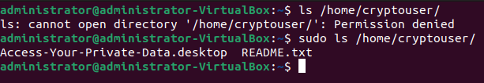
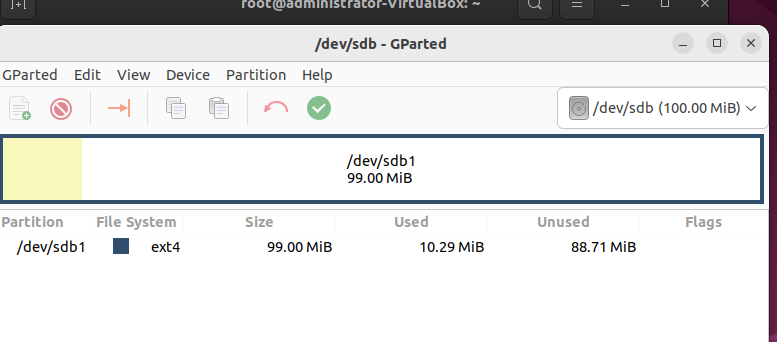
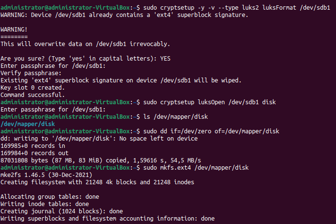
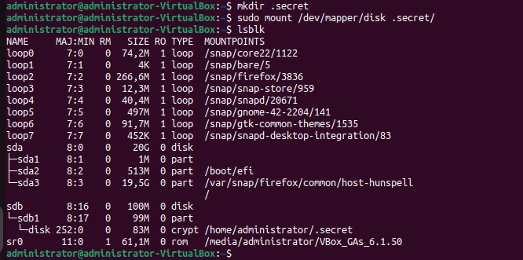
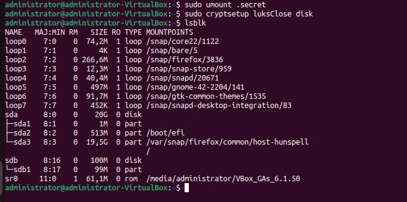

# Домашнее задание к занятию  «Защита хоста» - Дмитрий Дубровин
------

### Задание 1

1. Установите **eCryptfs**.
2. Добавьте пользователя cryptouser.
3. Зашифруйте домашний каталог пользователя с помощью eCryptfs.

*В качестве ответа пришлите снимки экрана домашнего каталога пользователя с исходными и зашифрованными данными.*  

```shell
sudo apt install ecryptfs-utils
sudo adduser --encrypt-home cryptouser
su - cryptouser
touch file_one file_two
ll
``` 

```shell
exit
ls /home/cryptouser
sudo ls /home/cryptouser
```



------
### Задание 2

1. Установите поддержку **LUKS**.
2. Создайте небольшой раздел, например, 100 Мб.
3. Зашифруйте созданный раздел с помощью LUKS.

*В качестве ответа пришлите снимки экрана с поэтапным выполнением задания.*
```shell
 sudo apt install gparted
 sudo apt-get install cryptsetup
```
Настраиваем партицию:\


```shell
sudo cryptsetup -y -v --type luks2 luksFormat /dev/sdb1
sudo cryptsetup luksOpen /dev/sdb1 disk
ls /dev/mapper/disk
sudo dd if=/dev/zero of=/dev/mapper/disk
sudo mkfs.ext4 /dev/mapper/disk
```



```shell
mkdir .secret
sudo mount /dev/mapper/disk .secret/
lsblk
```



```shell
sudo umount .secret
sudo cryptsetup luksClose disk
lsblk
```

-------
