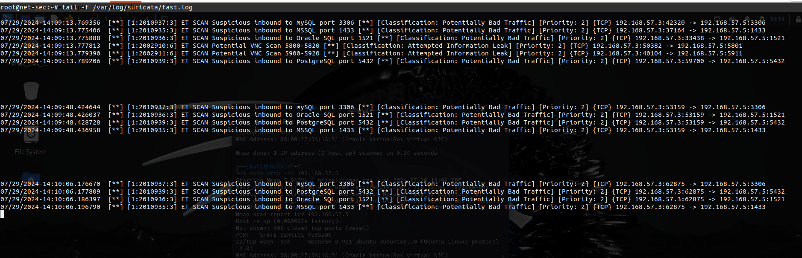
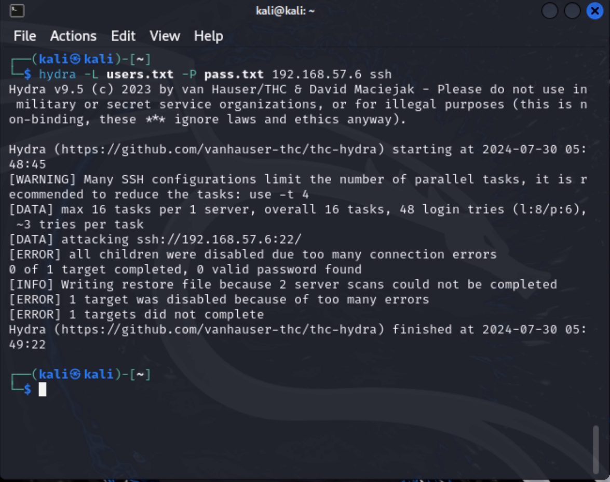
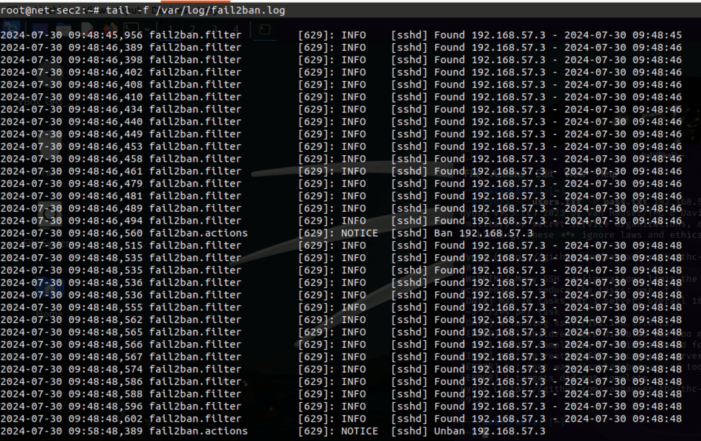
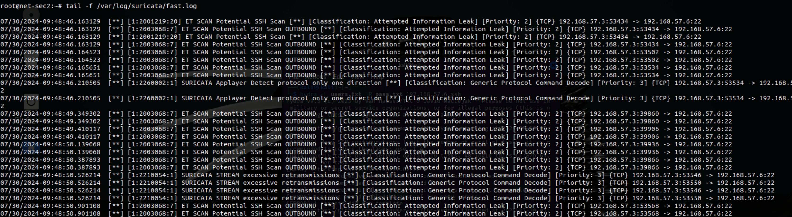

# Домашнее задание к занятию «Защита сети» - Дмитрий Дубровин

------

### Задание 1

Проведите разведку системы и определите, какие сетевые службы запущены на защищаемой системе:

**sudo nmap -sA < ip-адрес >**

**sudo nmap -sT < ip-адрес >**

**sudo nmap -sS < ip-адрес >**

**sudo nmap -sV < ip-адрес >**

По желанию можете поэкспериментировать с опциями: https://nmap.org/man/ru/man-briefoptions.html.

*В качестве ответа пришлите события, которые попали в логи Suricata и Fail2Ban, прокомментируйте результат.*

>Для в стандартном наборе, вероятно нет правил, соответственно она не считает ACK запросы угрозами. Для остальных трёх видов сканирования (три блока на скриншоте) такие правила в файле suricata.rules нашлись. 
> 
> fail2ban же отслеживает попытки подключения к серверу, поэтому при сканировании nmap'ом его лог пуст.
------

### Задание 2

Проведите атаку на подбор пароля для службы SSH:

**hydra -L users.txt -P pass.txt < ip-адрес > ssh**

1. Настройка **hydra**: 
 
 - создайте два файла: **users.txt** и **pass.txt**;
 - в каждой строчке первого файла должны быть имена пользователей, второго — пароли. В нашем случае это могут быть случайные строки, но ради эксперимента можете добавить имя и пароль существующего пользователя.

Дополнительная информация по **hydra**: https://kali.tools/?p=1847.

2. Включение защиты SSH для Fail2Ban:

-  открыть файл /etc/fail2ban/jail.conf,
-  найти секцию **ssh**,
-  установить **enabled**  в **true**.

Дополнительная информация по **Fail2Ban**:https://putty.org.ru/articles/fail2ban-ssh.html.

*В качестве ответа пришлите события, которые попали в логи Suricata и Fail2Ban, прокомментируйте результат.*

> Hydra, при включенном fail2ban'е не может выполнить атаку полностью, о чём и рапортует (впрочем, если искомая пара логин/пароль попадётся в первых проверках, атака пройдёт)
 

>File2ban логирует попытки доступа и на заданной неудачной блокирует подключение. Через время, определенное в конфиге (по умолчанию 10 минут) происходит разблокировка:

> В дефолтных правилах suricata содержится то, которое определяет перебор как потенциальное ssh сканирование:

